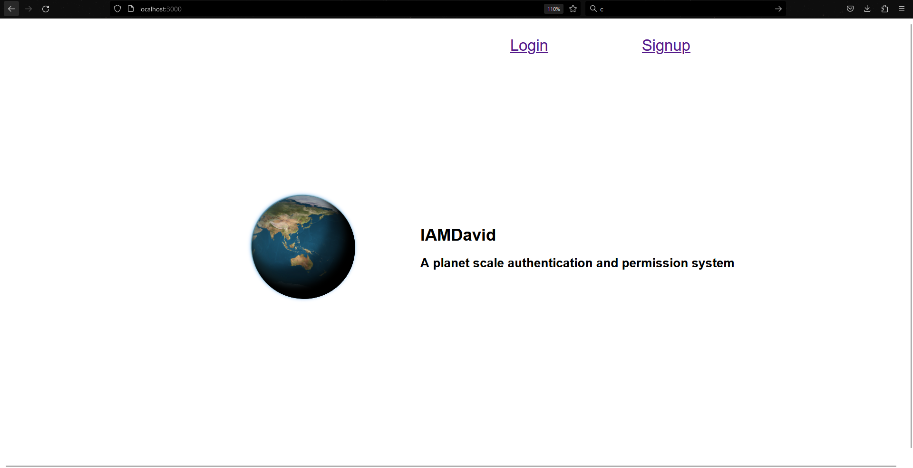
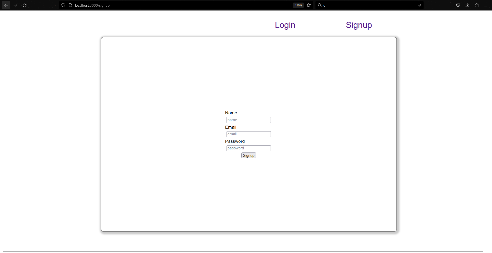
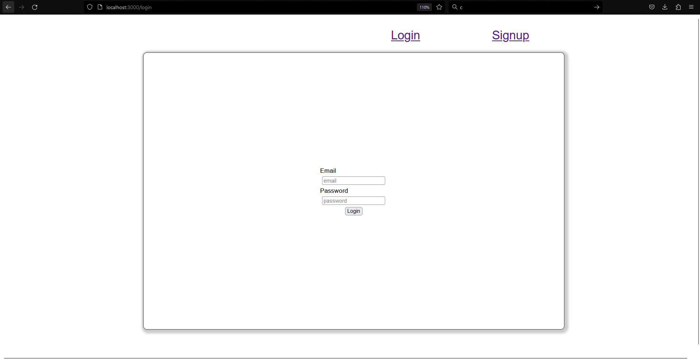
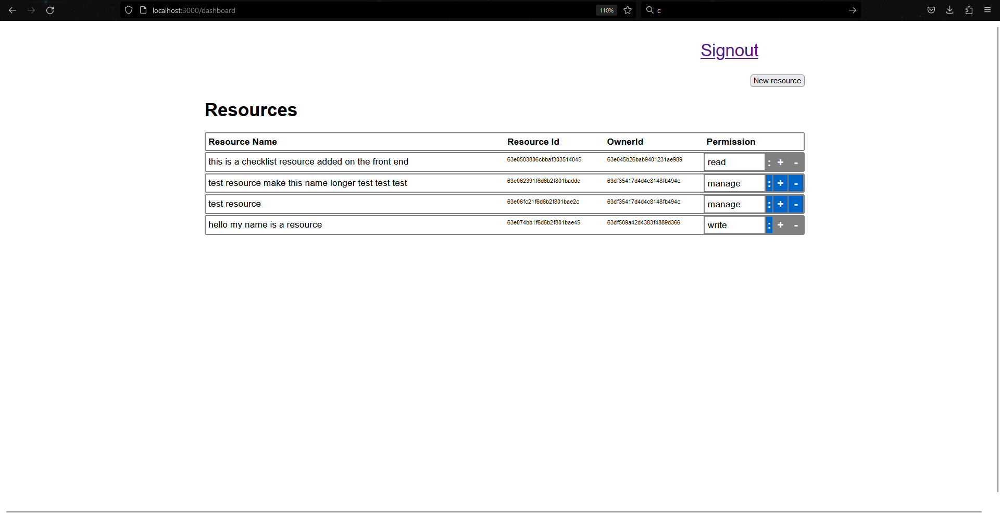
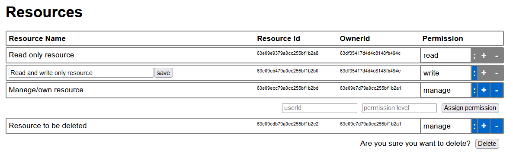

# IAM Service Project

## Table of Contents

- [Overview](#overview)
- [Demo](#demo)
- [Detailed Design](#detailed-design)
- [Future Work](#future-work)

## Overview

The IAM system designed contains two primary services: auth and permissions. The auth service is responsible for creating and authenticating users, while the permissions service handles controlling the Access Control Lists that these users have on various resources. The system supports **fine-grained ACL'ing**, meaning read, write or manage access can be granted on a **per-resource basis**. Given a resouce, the permissions service will determine what access a caller (identified by the auth service) has on the resource.

There is also a third resource service to perform CRUD operations on arbitrary resources, giving us an entity for our permissions service to operate on. This resource service is hosted alongside our auth and permissions service on the same API. In an ideal world, we would de-couple the IAM services (auth, permissions) from the resource service, and allow any client to use our IAM system with resources stored in their own databases. However, due to to time constraints, it was significantly easier to have all the API's under the same server for testing. An improved system is proposed in the 'Resources' section.

All three services are built using Node and Express, and exposed to clients via a REST API. MongoDB (a NoSQL database) was used as our storage system alongside Mongoose which provided us with more document structure via schemas.

Finally, we have a custom UI built using ReactJS to test the different components of our IAM system. We verify the auth functionality by allowing users to sign up and login to an account. We then provide the ability for users to create resources which they can then grant 'read', 'write' or 'manage' access to other users in the system. To show that permissions are working correctly, we display a table of all the resources that the logged in user has access to. Depending on the access type, the user can either:

1. View the resource
2. Edit the resource (change name)
3. Grant access to another user


## Demo

### Installation

To install the required dependencies, run this command in both the [client](./client) and [server](./server) directories:

```
npm install
```

You also need to install and use MongoDB Compass to properly run the server

### Usage

Create an .env file in the [server directory](./server) containing the following variables:

```
LOCAL_URI = <yourLocalMongoUri>
TOKEN_SECRET = <jwtSecret>
SERVER_URL = <yourLocalServer>
```

To start the server, navigate to the [server directory](./server) in a terminal and run:

```
npm start
```

To start the front-end application, navigate to [client directory](./client) in a terminal and run:

```
npm start
```

### Demo Application (React Frontend)

The Homepage offers two options for users: Login or Signup.



To register as a new user, select Signup and provide a name, email, and password. Once registered, the user will be redirected to the Dashboard.



Existing users can Login using their email and password, and they too will be redirected to the Dashboard.




The Dashboard displays all available resources, ie any resource the user has read, write or manage permission on. This is displayed in a tabled format. The user can also add a new resource by clicking the "Add Resource" button.



Based on the level of permission, users have the option to:

- Edit a resource by clicking the ":" button and changing the resource name.
- Assign permissions to a resource by clicking the "+" button and entering a UserID and ResourceID.
- Delete a resource by clicking the "-" button and confirming the deletion.




Greyed out buttons indicate that the user does not have permission to perform that action.

Users can sign out at any time by clicking the Sign Out button, which will redirect them back to the Homepage.

## Detailed Design

### Auth

We use a JWT based authentication system. We expose a `register` route which allows users to create a new account with an email and password. We do some basic verification to ensure that the email doesn't already exist, encrypt the password using `bcryptjs` and then persist both to the users table. A JWT is then returned to the client. Similarly, we have another `login` route which allows users to authenticate using an email and password. We use `bcryptjs` again to compare the password in the request with the hashed password from storage- returning a JWT if the comparison is successful.

The client persists this JWT to their local storage and includes this in the request header in all future requests to the server. We have an Express middleware to validate this JWT before every request, and save the decoded userId to the `req` object if successful. All routes have access to this `req` object and can use this userId to determine who is making the request (i.e for returning all permissions that a user has). The JWT also expires after a finite amount of time so user's would have to re-login/authenticate if they want to continue to make requests.

### Permissions

Our permission system optimizes for flexibility. We use a per-resource ACL system to allow clients to set 'read', 'write' or 'manage' permissions for a specific resource. A 'permission' in our system is simply a tuple containing `{resourceId, userId, permissionType}`. The aim of our system is to allow clients to integrate with our service as purely a permission store. We imagine a client to be a backend server for any application (i.e banking app, photo app, notes app) that needs fine grained control over what resources a user can access.

Since we only store ids, we push the responsibility to the client to manage the storage of the resources (i.e bank accounts, photos, notes) themselves. This approach allows us to decouple an access role (i.e reader, writer, manager) from the semantics of what each role means, since each client may have different requirements and can implement custom behavior as needed. For example, a photo application may require the 'writer' role to allow deleting a photo, while a note taking application may want the 'writer' role to allow edits for notes. It's not our responsibility to manage client logic.

We expose an API for all the basic read/write operations that a client needs to change access to a resource for a specific user, as well as checking whether a user has access to a specific resource.

#### `POST /permissions/`:

Insert operation that takes in a `permission` (read, write, manage) and `resourceId` in the body. This API grants the authenticated user with the supplied `permission` for the specific `resourceId`. This operation is only valid if no permissions for the `resourceId` exist. Otherwise, we throw an error.

#### `PUT /permissions/{resourceId}`:

Upsert operation that takes in a `permission` (read, write, manage) and a `targetUserId` in the body. This API grants the `targetUserId` the supplied `permission` on the `resourceId`. This operation is only valid for resources that already exist, and that the authenticated user owns (i.e has the `manage` permission for). Otherwise, we throw an error. This action is equivalent to one user giving access to another user for a resource they own. If the `targetUserId` already has a permission for the `resourceId`, it gets updated with the new `permission`.

#### `GET /permissions/`

Fetch operation that returns all the permissions that the currently authenticated user has on any resource in the system.

#### `GET /permissions/{resourceId}`

Fetch operation that takes in a `permission` and returns a boolean depending on whether the authenticated the supplied `permission` on the `resourceId`. This is the primary API used to do ACL checks.

#### `GET /permissions/{resourceId}/users`

Fetch operation that takes a `resourceId` and returns all users with a permission on the resource, if the user has a `manage` permission.

#### `DELETE /permissions/{resourceId}`

Delete operation that deletes all the permissions for a given `resourceId`. We validate that the authenticated user has the 'manage' permission on the `resourceId`. Otherwise, we throw an error. This API is used to 'clear' a resource from the permission system (i.e the resource itself was deleted from the clients database).

### Resources

The Resource API is purely used to demonstrate the functionality of our Permission API with the demo front end. The API handles CRUD operations for a 'Resource' object and makes calls to the Permission API† to handle ACL's. For example, the `GET /resources/` route returns all Resources that the authenticated user has access to. This route does the following:

1. Read all the Permissions the user has on any resource using the `GET /permissions` API†
2. Retrieve all the Resources associated with these Permissions
3. Add the `permission` (i.e read, write, manage) from the Permission to each Resource
4. Returns the final list of Resources to the client

The Resource API attempts to simulate an actual client of the IAM service. It represents the 'server' for another application that has integrated with our IAM service. Although we're hosting this Resource API on the same server as our Auth and Permission service, it should be completely separate. Ideally it should have been apart of the 'Demo Application' as the backend for the React project. However, this was infeasible due to time constraints. We include a diagram below to show what this system should look like in reality.


With this new design, we have decoupled the Permission system from the resources that the permission system is managing.

†: Since the Resources API and Permissions API are hosted on the same server, we simulate a network request from the Resource API to the Permissions API using an internal function call.

## Future Work

### Group Support

For our IAM system to be productionizable, we would need to allow setting Permissions for different groups, where each group represents a client of our system. For example, Constantinople would use the "cxnpl" group, while another notetaking app would use the "notes" group. Permissions are created, checked and deleted or a per-group basis. Resource ids would also then only need to be unique on a per-group basis (i.e both Constantinople and a note taking app could have permissions for a resource with id `123` that don't interfere with each other).

To support this functionality, the Permission tuple should be `groupId, resourceId, userId, permissionType`. Each API would then also take in a `groupId` which would be used for all the reads and writes.

Additionally, we would also have to support some more permission functionality to allow certain users to create and manage groups. This would require adding user-level access controls which our system currently lacks, since it focused primarily on resource-level access controls.

### Better User Access Controls

As mentioned above, I prioritized more on the 'permission' side of the project spec, rather than the 'user' side. The proposed system has great per-resource access controls, but practically zero per-user access controls. There's no way to give one user higher access than another user (i.e so they can delete the other users account). If given more time, I would have added better support here.

### Flexible role types

There's nothing requiring us to have only 'read', 'write' and 'manage' permissions. As mentioned in the 'Permissions' section, permissions are just arbitrary strings that are stored in our system. It's up to the client to determine they actually do. The only permission that our system cares about is 'manage' since it's used to determine whether a user can grant permissions for a resource to another user.

If we implement the 'better user access controls' above and introduce 'admin' accounts, we can grant admins the capability to create additional permissions for their group (assuming 'group support' above is implemented too). Each group could be initialized with just the 'manage' role which the 'admin' user would have by default. Then, the admin would be able to call a new API that would allow them to introduce a new role for their group. All other non admin users can then use this role in our existing write APIs. For example, some clients may choose to use the term 'view' for their 'read' permission.
